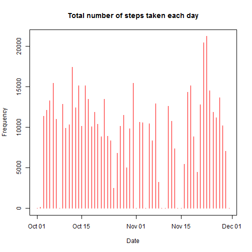
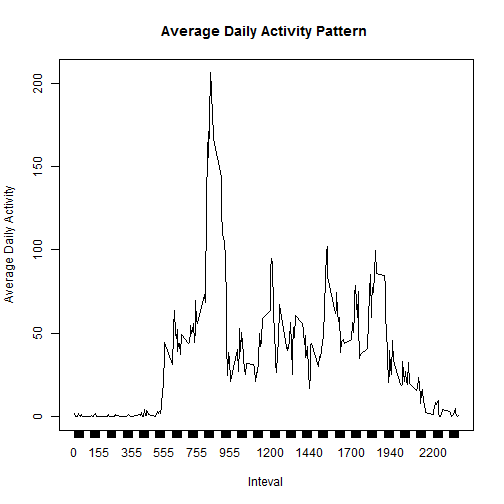
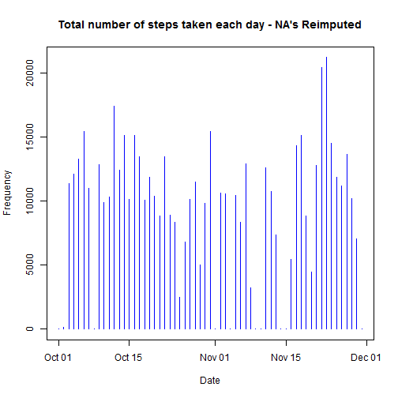
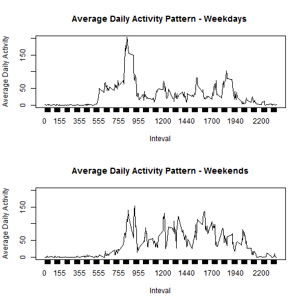

#### Introduction
It is now possible to collect a large amount of data about personal movement using activity monitoring devices such as a Fitbit, Nike Fuelband, or Jawbone Up. These type of devices are part of the "quantified self" movement - a group of enthusiasts who take measurements about themselves regularly to improve their health, to find patterns in their behavior, or because they are tech geeks. But these data remain under-utilized both because the raw data are hard to obtain and there is a lack of statistical methods and software for processing and interpreting the data.

This assignment makes use of data from a personal activity monitoring device. This device collects data at 5 minute intervals through out the day. The data consists of two months of data from an anonymous individual collected during the months of October and November, 2012 and include the number of steps taken in 5 minute intervals each day.


### Loading and processing the data


The data is fed into the program and the date column is set to 'Date' data type


```r
activity = read.csv("./activity.csv")
```

```
## Warning in file(file, "rt"): cannot open file './activity.csv': No such
## file or directory
```

```
## Error in file(file, "rt"): cannot open the connection
```

```r
activity$date = as.Date(activity$date)
```

### What is mean total number of steps taken per day?

The total number of steps taken per day, the mean and median are computed in the table below:


```r
activityStats
```

```
## Source: local data frame [61 x 5]
## 
##          date count StepsEachDay     Mean Median
##        (date) (int)        (int)    (dbl)  (dbl)
## 1  2012-10-01   288            0      NaN     NA
## 2  2012-10-02   288          126  0.43750      0
## 3  2012-10-03   288        11352 39.41667      0
## 4  2012-10-04   288        12116 42.06944      0
## 5  2012-10-05   288        13294 46.15972      0
## 6  2012-10-06   288        15420 53.54167      0
## 7  2012-10-07   288        11015 38.24653      0
## 8  2012-10-08   288            0      NaN     NA
## 9  2012-10-09   288        12811 44.48264      0
## 10 2012-10-10   288         9900 34.37500      0
## ..        ...   ...          ...      ...    ...
```

The histogram of total number of steps taken each day
 

### What is the average daily activity pattern?
The average number of steps taken for each of the 5-minute interval is computed acroos all days.

```r
avgDailyActivity = activity %>% group_by(interval) %>%
    summarize(Mean = mean(steps, na.rm = TRUE))

avgDailyActivity
```

```
## Source: local data frame [288 x 2]
## 
##    interval      Mean
##       (int)     (dbl)
## 1         0 1.7169811
## 2         5 0.3396226
## 3        10 0.1320755
## 4        15 0.1509434
## 5        20 0.0754717
## 6        25 2.0943396
## 7        30 0.5283019
## 8        35 0.8679245
## 9        40 0.0000000
## 10       45 1.4716981
## ..      ...       ...
```

The average daily activity pattern is show below.
 

**Note**: The tic marks in the x-axis are not contineous as the interval sample duration in the given data is not uniform 

On an average across all days in the dataset, 835 5-minute interval contains maximum number of steps

### Imputing missing values

The total number of missing values in the data are 2304

The missing values were reimputed with 0s and the copy for the new dataset is created

```r
activityReimputed = activity
idx <- data.frame(which(is.na(activity), arr.ind=TRUE))
for (i in idx$row){
    activityReimputed[i,"steps"] = 0
}
```

The dataset activityReimputed is equal to the original dataset but with the missing values re-imputed.The complete file can be found in the github directory.


```r
head(activityReimputed)
```

```
##   steps       date interval
## 1     0 2012-10-01        0
## 2     0 2012-10-01        5
## 3     0 2012-10-01       10
## 4     0 2012-10-01       15
## 5     0 2012-10-01       20
## 6     0 2012-10-01       25
```

The mean and median total number of steps taken per day, using the reimputed dataset is below.

```r
activityStatsReimputed = activityReimputed %>% 
                        group_by(date) %>% 
                        summarize(count = n(),
                                StepsEachDay = sum(steps, na.rm = TRUE),
                                Mean = mean(steps,na.rm = TRUE),
                                Median = median(steps,na.rm = TRUE))
```

The histogram of total number of steps taken per day
 

### Are there differences in activity patterns between weekdays and weekends?

In order to find if there are any differences in the activity patterns between weekdays and weekends, a new factor variable with two levels ("weekday" and "weekend") are added  indicating the given date is weekday or weekend day


```r
weekdays1 <- c('Monday', 'Tuesday', 'Wednesday', 'Thursday', 'Friday')

activityReimputed$Day <- factor((weekdays(activityReimputed$date) %in% weekdays1), 
                   levels=c(FALSE, TRUE), labels=c('weekend', 'weekday'))
```

A panel plot containing a time series plot of the 5-minute interval (x-axis) and the average number of steps taken, averaged across all weekday days or weekend days (y-axis) is plotted

 
